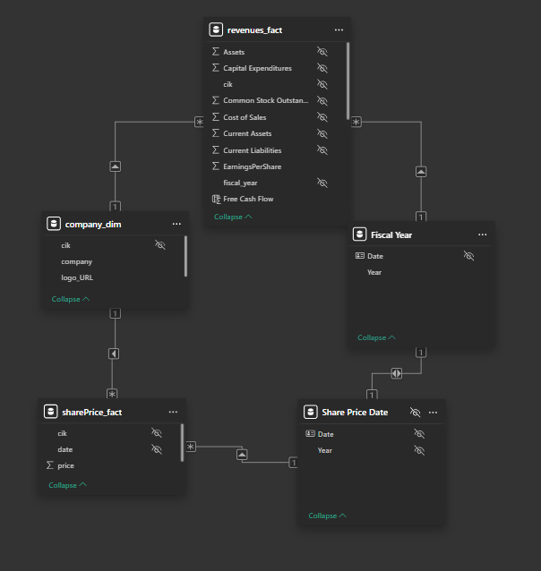
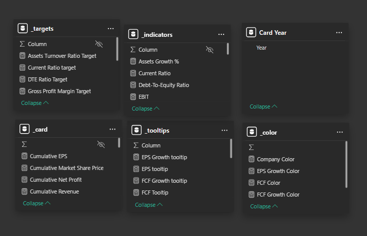
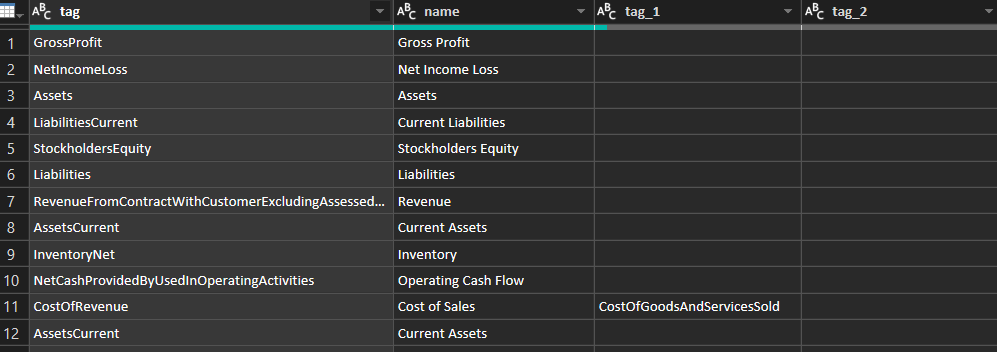

# 📊 Project Title – One-Line Description


## 📑 Table of Contents  
- [🔎 Executive Summary](#-executive-summary)  
- [❓ Problem Statement](#-problem-statement)  
- [🎯 Objectives](#-objectives)  
- [📥 Data Sourcing](#-data-sourcing)  
- [🏗️ Data Model Formation](#-data-model-formation)  
- [🛠️ Skills & Tools Demonstrated](#️-skills--tools-demonstrated)  
- [📂 Project Workflow](#-project-workflow)  
- [📈 Key Results & Insights](#-key-results--insights)  
- [💡 What I Learned](#-what-i-learned)  
- [✅ Best Approach (My Perspective)](#-best-approach-my-perspective)  
- [🚀 How to Reproduce This Project](#-how-to-reproduce-this-project)
- [Challenges I faced](#challenges-i-faced)
- [📊 Project Structure](#-project-structure)  
- [📌 Next Steps](#-next-steps)  
- [🔜 My Next Project](#-my-next-project)  
- [🙋 About Me](#-about-me) 

https://app.powerbi.com/groups/me/reports/19c45587-ee7c-4119-ad00-436c31009fa8/01bd393a8b71a60ca994?experience=power-bi&bookmarkGuid=36654765797e8b09abe8

## 🔎 Executive Summary  
Provide a concise summary of your project. Highlight the problem you solved, your methodology, and the key insights or results. Keep this section short but impactful to grab attention.  

---

## ❓ Problem Statement  
Describe the business problem or analytical challenge that motivated the project. Make it relatable to real-world scenarios or industry needs.  

*Example:*  
Customer churn poses a significant risk to subscription-based businesses. Understanding why customers leave and predicting who is at risk enables proactive retention strategies.  

---

## 🎯 Objectives  
- Clearly state what you set out to achieve.  
- Mention the analytical or business goals.  

---

## 🛠️ Skills & Tools Demonstrated  
- **Programming & Analysis:** Python (Pandas, NumPy), R, SQL  
- **Visualization:** Matplotlib, Seaborn, Tableau, Power BI  
- **Modeling & Statistics:** Regression, Classification, Clustering, Hypothesis Testing  
- **Workflow Tools:** Jupyter Notebook, Git/GitHub, Excel  

---

## 📂 Project Workflow  
1. **Data Collection & Cleaning** – Sourcing and preparing the dataset.  
2. **Exploratory Data Analysis (EDA)** – Identifying patterns, trends, and anomalies.  
3. **Visualization** – Creating charts and dashboards to communicate findings.  
4. **Modeling / Hypothesis Testing** – Applying analytical or predictive techniques.  
5. **Insights & Recommendations** – Translating results into actionable outcomes.  

---

## 📥 Data Sourcing  
- Explain **where and how** you obtained the dataset (public datasets, APIs, surveys, Kaggle, government portals, simulated data, etc.).  
- Describe any data transformation performed before analysis.  

*Example:*  
The dataset was sourced from Kaggle’s Telco Customer Churn dataset. Additional demographic data was scraped from open census APIs to enrich the analysis. Raw data contained 7,043 customer records with 21 features.  

---

## 🏗️ Data Model Formation  
- Outline **how you structured the dataset** for analysis/modeling.  
- Mention feature engineering, variable selection, or data schema design.  
- If you built a predictive/statistical model, describe the logic.  




*Example:*  
I developed a classification model where the **target variable** was `Churn` (Yes/No).  
- Categorical variables were encoded using One-Hot Encoding.  
- Continuous variables were standardized.  
- Missing values were imputed using median values.  
- Final dataset contained 35 engineered features, which were fed into Logistic Regression and Random Forest models for prediction.  


## 📈 Key Results & Insights  
- List 3–5 top findings from your analysis.  
- Present insights in clear, recruiter-friendly language.  
- Use visuals (charts, screenshots) if possible.  

---

## 💡 What I Learned  
- Point out new technical or analytical skills you gained.  
- Highlight soft skills like communication or problem framing.  
- Show reflection and growth from the project.  

---

## ✅ Best Approach (My Perspective)  
Briefly describe what you believe is the **most effective way to solve the problem** if you had more resources or time.  

*Example:*  
While the logistic regression model provided decent accuracy, I believe combining it with ensemble methods like Random Forest or Gradient Boosting, alongside deeper feature engineering, would yield stronger predictive performance.  

---

## 🚀 How to SetUp This Project 
There are two ways to setup this project.
1. Download the zip file from GitHub and extract.
    - Navigate to this [GitHub page](https://github.com/emma-fosu/Financial-Performance-Dashboard-Zoom-Inc.-Synopsys-Inc.-)
    - Click on the green `code` button at the top right.
    - Click on `Download ZIP`.
    - Extract the downloaded zip and open `financial performance.pbix`

2. Clone from GitHub.
    - Open your Command Prompt program and paste in  `git clone https://github.com/emma-fosu/Financial-Performance-Dashboard-Zoom-Inc.-Synopsys-Inc.-.git`.
    - Press `Enter` to clone the repository.
    - Open the folder to access `financial performance.pbix`.  
**NOTE**: You need to have Power BI installed locally to view this file.   
To view the dashboard online, navigate to this [page](https://app.powerbi.com/groups/me/reports/19c45587-ee7c-4119-ad00-436c31009fa8/01bd393a8b71a60ca994?experience=power-bi&bookmarkGuid=36654765797e8b09abe8).

## Data Model


## 📊 Project Structure
```bash
├── images/                          # Images used for README.md
├── financial performance.pbix       # Financial Dashboard Power BI file
└── README.md                        # Project documentation
```

📌 Next Steps

## Challenges I faced
1. **Data source:** Initially, the proposal for the data source was to get all the available 10-K forms of both Zoom, Inc. and  Synopsys, Inc. into a folder then use power to select the necessary sheets and transform the data. But, both companies' financial statements have different sheets layout and names, different financial name for the same thing, different value formats and different table structure.  
**Solution**: SEC EDGAR (Electronic Data Gathering, Analysis, and Retrieval) APIs.    
It is a web-based interface provided by the U.S. Securities and Exchange Commission (SEC) that allows developers and analysts to programmatically access public company filings and financial data submitted to the SEC.   
The company-concept API was used and it returns all the XBRL disclosures from a single company (CIK) and concept (a taxonomy and tag) into a single JSON file, with a separate array of facts for each units on measure that the company has chosen to disclose (e.g. net profits reported in U.S. dollars and in Canadian dollars).
`https://data.sec.gov/api/xbrl/companyconcept/CIK[Company's CIK Number]/[Taxonomy]/[Tag].json`.  
The JSON structures are updated throughout the day.
2. **Tag Names Mismatch:** Because EDGAR allows companies to extend the service with their own tag names, there were some mismatches and errors when the same tag is used for both companies.  
**Solution**: A tag dimension table was created to map different tage names to a single well-defined name. The tag table provided three alternatives for the same tag and in case the first tag fails, subsequent alternatives are used until there is a resolution. 

*For example, the `CostOfRevenue` has another tag `CostofGoodAndServicesSold`. If `CostOfRevenue` is not a recognized tag name for the company, `CostofGoodAndServicesSold` is used instead. If it also fails, then no data will be collected for such tag.*  

3. **Testing for valid frames:** Every EDGAR XBRL disclosures has a `frame` field that referst to the snapshot of a company's financial data for a specific reporting period or time frame. Eg. a frame with the value `CY2023Q4I` means Calender Year 2023, Quarter 4, Instant value. For only 10-K Forms, the frame values are different for each tag. To retrieve the right frame, each has to be tested to the right format or pattern. To do this, a regular expression pattern matching is needed but unfortunately, M language does not support it.   
**Solution**: A workaround was done by executing a JavaScript code with the `RegExp` Object. M language support executing JS code with the `Web.Page` function.
```fsharp
    let 
        regex_test = (regex as text, str as text, optional options as text) as logical => 
        let
            optionsActual = if options = null then "" else options,
            script = "<script>
                        regex = '"&regex&"';
                        str = '"&str&"';
                        options = '"&optionsActual&"';
                        document.write(new RegExp(regex, options).test(str));
                    </script>",
            res = Web.Page(script){0}[Data]{0}[Children]{1}[Children]{0}[Text]
        in
            Logical.FromText(res)
    in regex_test
```
*The code snippet of the `regex_test` function used to test for valid frames.*  
4. **Extracting the year from the frames:** Similarly to testing for valid frames, the fiscal year for each tag was needed. Power Query M Language does not support extracting string with a regular expression pattern matching technique, so the same workaround for testing valid frames was used.    
**Solution**: A `regex_search` function that used JavaScript code to search for the substring matching the provided pattern.

```fsharp
(regex as text, str as text, optional options as text) => 
let
    optionsActual = if options = null then "" else options,
    script = "<script>
                regex = '"&regex&"';
                str = '"&str&"';
                options = '"&optionsActual&"';
                document.write(str.search(new RegExp(regex, options)));
             </script>",
    res = Web.Page(script){0}[Data]{0}[Children]{1}[Children]{0}[Text]
in
    res
```
## 🔜 My Next Project

### Divvy Bike-Sharing Riding Pattern
My next project will focus on determing consumer pattern for a bike-sharing company. The marketing team wants to understand how the two subscribers (casual and member) use the service. The team has proposed that converting more casuals into members will increase revenue significantly. This next project will aim at stating the riding patterns of casual and members and how to convert casual to member.

## 🙋 Contact Me

🔗 LinkedIn: [www.linkedin.com/in/emma-fosu](www.linkedin.com/in/emma-fosu)

🔗 Portfolio: []()

🔗 Email: [emmanuelfosu.duffour@gmail.com](mailto:emmanuelfosu.duffour@gmail.com)`