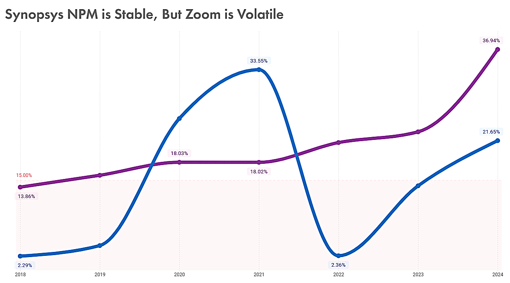
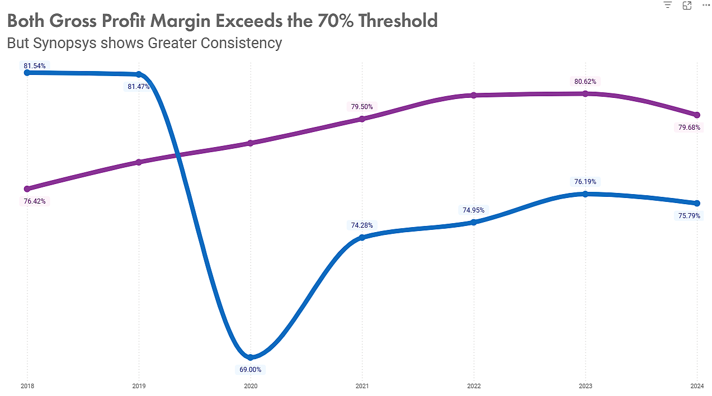
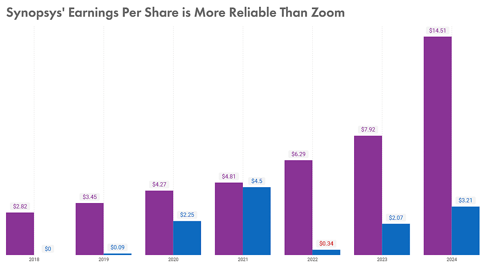
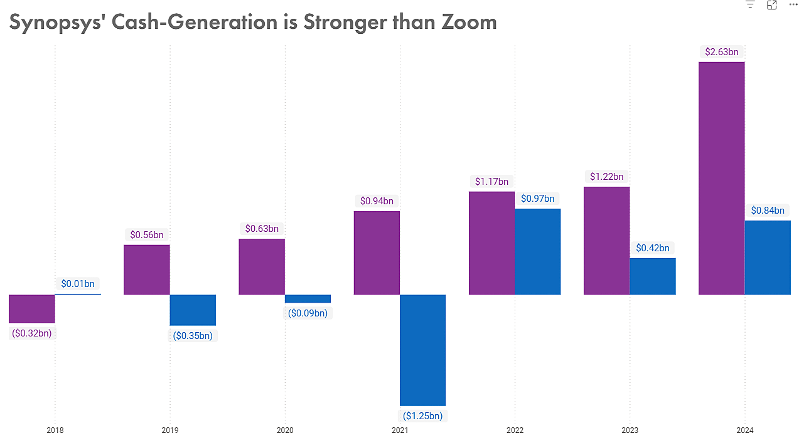
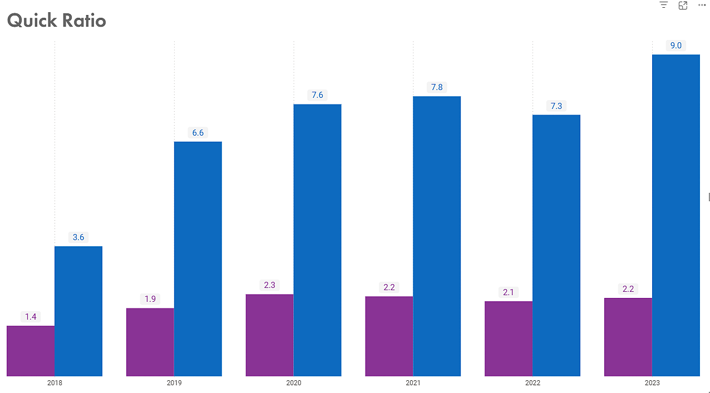
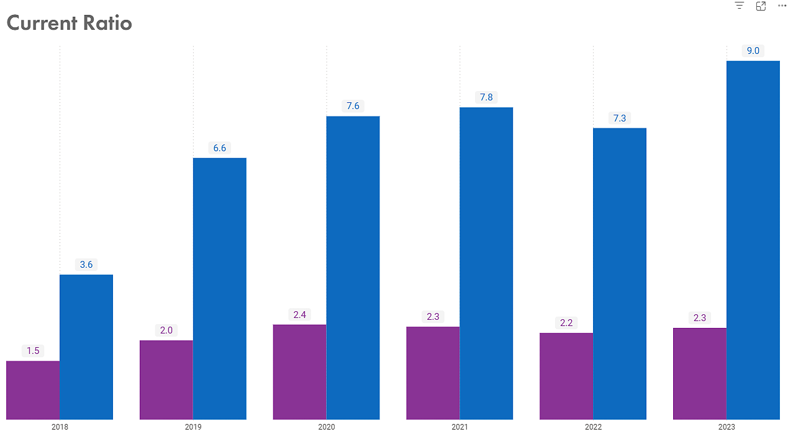
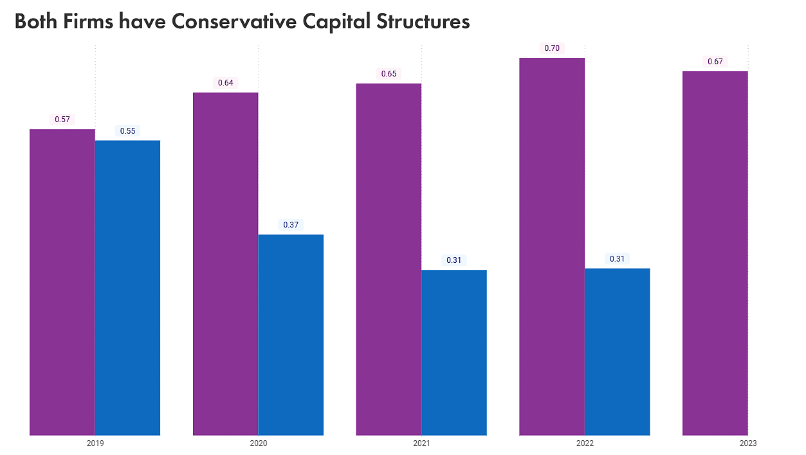
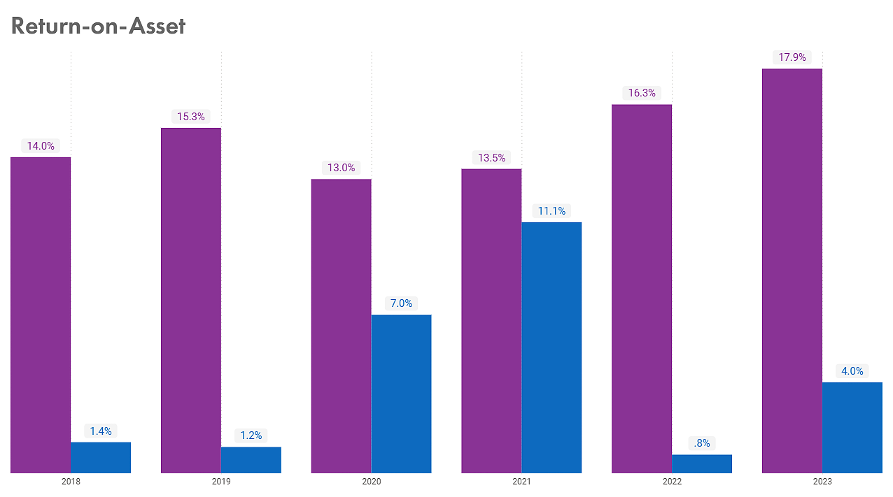
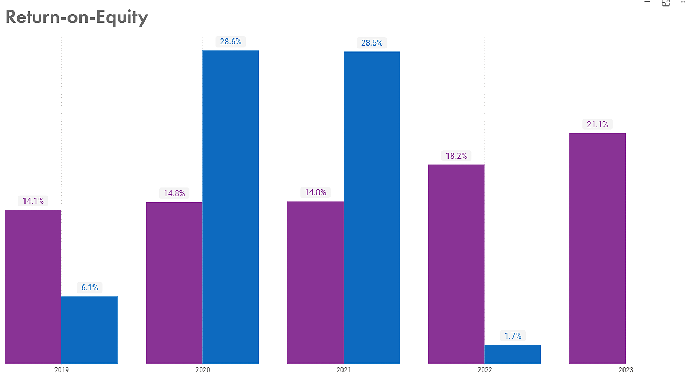

# Zoom vs Synopsys Financial Performance Analysis


> To view and interact the dashboard click [here](https://app.powerbi.com/groups/me/reports/19c45587-ee7c-4119-ad00-436c31009fa8/01bd393a8b71a60ca994?experience=power-bi&bookmarkGuid=36654765797e8b09abe8).

## Table of Contents
- [Project Overview](#project-overview)
- [Executive Summary](#executive-summary)
- [Problem Statement](#problem-statement)
- [Objectives](#objectives)
- [Key Results & Insights](#key-results--insights)
- [Conclusion](#conclusion)
- [Skills & Tools Demonstrated](#skills--tools-demonstrated)
- [Project Workflow](#project-workflow)
- [What I Learned](#what-i-learned)
- [Lessons Learned and Future Improvements](#lessons-learned-and-future-improvements)
- [How to Setup This Project](#how-to-setup-this-project)
- [Project Structure](#project-structure)
- [Contact Me](#contact-me)


## Project Overview
This project analyses and visualises the financial performance of **Zoom Video Communications** and **Synopsys** to support informed investment decision-making. Using a comparative dashboard, the project examines revenue trends, profitability, and key performance indicators to highlight differences in business stability, growth potential, and risk profiles.

## Executive Summary
Zoom exhibits strengths in liquidity and maintains a debt-free capital structure. However, its earnings, free cash flow, and valuation metrics are **highly volatile**, reflecting sensitivity to external shocks such as **post-pandemic demand normalization**. This volatility introduces uncertainty for long-term investors seeking predictable returns.

Synopsys, in contrast, demonstrates **superior financial stability** across nearly all key metrics. It delivers consistent growth in net income, EPS, and free cash flow, maintains strong profitability efficiency, and commands a valuation premium supported by durable earnings and structural growth drivers. Its modest use of leverage further enhances returns without materially increasing risk.


## Problem Statement
Investment decision-making relies heavily on the accurate comparison of a company's financial performance using metrics derived from **SEC filings**, such as **income statements**, **balance sheets**, and **cash flow statements**. However, manually reviewing SEC filings across multiple companies is inefficient, time-consuming, and error-prone because each company files reports in different formats, reporting periods, and disclosure structures.

As the number of companies under review increases, the effort required to extract, normalise, and analyse financial data from individual SEC filings grows exponentially; hence, manual analysis quickly becomes outdated, as new filings are released quarterly and annually. This inefficiency limits timely insights, reduces analytical coverage, and constrains investors’ ability to respond promptly to changing financial conditions.

## Objectives
The project aims to:

1. Retrieve financial statement data directly from the **SEC API** in a structured and standardized format.
2. Compute and compare key investment metrics (e.g., **margins**, **EPS**, **Free Cash Flow**) across multiple companies.
3. Enable easy expansion to include additional companies without increasing manual effort.
4. Automatically refresh analyses as new SEC filings are released, ensuring insights remain current.
5. Support more informed, timely, and data-driven investment decisions.

## Key Results & Insights
- **Synopsys Net Margin is Stable But Zoom's Volatility Introduces Uncertainty**   
    Zoom and Synopsys both demonstrate strong profitability, with peak net income margins reaching approximately **30%**. However, Zoom’s net income margin is highly volatile. It peaked in **2021** and experienced a sharp decline the following year, reflecting its sensitivity to demand shocks and post-pandemic normalization.

        

    In contrast, Synopsys has recorded a **steady and consistent increase** in net income margin over the past five years, reaching its highest level in **2024**. This stability indicates stronger earnings resilience and operational discipline.

- **Both Demonstrate Strong Cost Efficiency, though Synopsys shows Greater Consistency Over Time.**   
    Both companies consistently maintain gross margins above the **70%** benchmark, indicating strong pricing power and operational efficiency but an exception occurred in 2020 when Zoom’s gross margin declined sharply from **82%** to **69%**. This drop can be attributed to the pandemic-driven surge in usage, particularly from free users for educational and social purposes, which significantly increased infrastructure and hosting costs, thereby raising COGS.

     

    Synopsys, by contrast, exhibited a steady upward trend in gross margin for several years, with only a modest decline from **81%** to **79%** in the most recent year.


- **Synopsys offers Superior Investment Profitability and a more Reliable Earnings Record than Zoom.**   
    Zoom’s EPS has been volatile, reaching its lowest point of **$0.34** in **2022**. Over the past eight years, Zoom’s EPS has not surpassed even the lowest EPS recorded by Synopsys during the same period.

    

    Synopsys has delivered consistent and robust EPS growth, peaking at **$14.50** in 2024. This reflects strong earnings quality and long-term value creation.

- **Synopsys exhibits Strong and improving Cash-Generation Capability, while Zoom’s FCF is Poor.**  
    Zoom’s free cash flow performance over the past eight years has been weak and **highly volatile**, with **negative FCF** recorded in alternating years on **three occasions**. This indicates instability in cash generation and weaker operating leverage.

    

    Synopsys, on the other hand, has demonstrated strong and consistent FCF growth, reaching approximately **$2.6 billion** in **2024**, representing a **115%** year-over-year increase.

- **Zoom has a stronger short-term liquidity position, though both firms are financially sound in this regard.**

    
    

    Both companies maintain healthy liquidity positions, with quick ratios above 1 and current ratios above **1.5**. Zoom’s liquidity ratios are higher, indicating a greater capacity to meet short-term obligations.

- **Both Firms have Conservative Capital Structures, with Zoom being virtually Debt-Free and Synopsys employing Modest Leverage efficiently.**   
    Zoom recorded **negative debt-to-equity ratios** in its early years **(2017–2019)** due to negative shareholder equity. Since becoming a public company, Zoom has maintained a near-zero debt-to-equity ratio and is effectively debt-free, supported by a strong balance sheet.

    

    Synopsys has consistently maintained a low but positive debt-to-equity ratio, typically ranging between **0.00** and **0.50**, reflecting prudent use of leverage without excessive financial risk.

- **Synopsys commands a Premium Valuation justified by Earnings Stability while Zoom has sharply normalized from Extreme Highs to a Lower, Mature Valuation.** 
    Synopsys has consistently traded at a **premium P/E**, reflecting sustained investor confidence in its long-term earnings growth and strategic importance in the semiconductor and EDA ecosystem. Its valuation has remained relatively stable and elevated, indicating that the market expects continued, durable growth.  

    

    In contrast, Zoom’s P/E has been **highly volatile**, peaking at extreme levels around its IPO and during the pandemic due to rapid adoption and a low earnings base, then compressing sharply as growth normalized. Today, Zoom trades at a much lower, more mature valuation, signaling reduced growth expectations but improved earnings stability.

- **Synopsys outperforms Zoom in Profitability Efficiency and Capital Utilization.**   
    Zoom’s ROE and ROA are moderate, indicating reasonable profitability but weaker efficiency compared to high-performing technology peers.

    
    

    Synopsys exhibits strong ROE and ROA relative to the broader software sector, demonstrating efficient utilization of both equity and assets to generate earnings.

### Summary of Financial Performance of Zoom and Synopsys
| Metric | Zoom Video Communications | Synopsys |
|--------|---------------------------|----------| 
|**Net Income Margin**|	High but volatile |	High and stable	Synopsys|
| **Gross Profit Margin** |	Strong but volatile | Strong and consistent	|
| **EPS** |	Volatile, low growth | Strong, steady growth |
| **Free Cash Flow** |	Volatile, occasionally negative | Strong and growing |
| **Liquidity Ratios** |	Very strong |	Strong |
| **Debt-to-Equity** |	Near zero (debt-free) |	Low and stable |
| **P/E** | Ratio	Low, volatile |	High, stable premium |
| **ROE / ROA**	| Moderate	| Strong and efficient |

## Conclusion
Investors should allocate capital to **Synopsys** as a **long-term holding**, supported by its consistent earnings growth, strong cash-flow generation, and efficient capital utilization. Exposure to Zoom should be **limited or deferred** until the company demonstrates sustained **earnings stability** and **predictable cash-flow performance**.

## Skills & Tools Demonstrated
- Data extraction through REST APIs.
- Ability to interpret **SEC EDGAR API** documentation to identify appropriate endpoints, URL field and parameters including taxonomies and tags required for retrieving and preparing accurate data for analysis.
- Data cleaning and transformation using Power Query (**M language**, **user-defined functions**, **column pivoting**, **API request and error handling** )
- Performed **data modeling** by defining table relationships, creating measures using **DAX**, building hierarchies, and applying proper star schema design to improve calculation accuracy and report performance.
- Data visualization using built-in Power BI visuals and **custom KPI visuals** with **Deneb (vega-lite)**.
- **Workflow Tools:** Power BI, Git/GitHub.


## Project Workflow
### Data Sourcing
The data was sourced from the **SEC EDGAR (Electronic Data Gathering, Analysis, and Retrieval) API**. It is a web-based interface provided by the U.S. Securities and Exchange Commission (SEC) that allows for programmatically accessing public company filings (10-K, 10-Q, 8-K, etc.) and financial data submitted to the SEC. Read more about the [**EDGAR API.**](https://www.sec.gov/search-filings/edgar-application-programming-interfaces)

The company-concept API was used to retrieve the XBRL disclosures from a single company (CIK) and concept (a taxonomy and tag) into a single JSON file.   

API: `https://data.sec.gov/api/xbrl/companyconcept/CIK##########/{taxonomy}/{tag}.json`
- `CIK##########` - represent the CIK number for a company. You can find the CIK number of a company [here.](https://www.sec.gov/search-filings/cik-lookup)
- `taxonomy` - A taxonomy is a structured dictionary of financial reporting concepts defined by accounting standards like `us-gaap` or `ifrs`. Each taxonomy has its own standardized concepts (tags). For example: `us-gaap` has concepts such as  `Assets`, `Revenues`, `Liabilities`, etc.
- `tag` - is the individual data elements within a taxonomy.
    For example, under the us-gaap taxonomy, you might have tags like:
    - `us-gaap:Assets` — Total assets reported by the company
    - `us-gaap:Liabilities` — Total liabilities
    - `us-gaap:Revenues` — Reported revenues  
To know the available taxonomy and tags from the financial statement, open any financial form in the XBRL viewer and click on any highlighted value to get the taxonomy and tag.
An example of Zoom, Inc. 10-K is provided [here](https://www.sec.gov/ix?doc=/Archives/edgar/data/0001585521/000158552125000042/zm-20250131.htm#fact-identifier-82).

    ```fsharp
        let
            GetAPIData = (CIK as text, tag as text) =>
            let
                Source = Json.Document(
                    Web.Contents(
                        "https://data.sec.gov/api/xbrl/companyconcept/CIK" & CIK& "/us-gaap/" & tag & ".json",
                        [
                            Headers = [
                                #"User-Agent" = "Emmanuel Fosu emmanuel.fosuduffour@gmail.com"
                            ]
                        ])),
                Data   = Table.FromRecords({Source}) 
            in
                Data
        in
            GetAPIData
    ```
    _This is the query function used to get various tag values with us-gaap taxonomy from the financial forms._

### Data Cleaning and Transformation
1. A company–tag mapping table was created where each company (identified by cik) is paired with all relevant tag attributes.
    ```fsharp
    Source = Table.SelectColumns(company_dim, "cik"),
        #"Added tags" = Table.AddColumn(Source, "tags", each tags_dim),
        #"Expanded tags" = Table.ExpandTableColumn(#"Added tags", "tags", {"tag", "name", "tag_1", "tag_2"}, {"tag", "name", "tag_1", "tag_2"})
    ```

2. After building the company–tag mapping table, the next stage involved fetching financial data from an external API using each company’s CIK and associated tag values.
    ```fsharp
     #"Added fectched data" = Table.AddColumn(
                                    #"Expanded tags", 
                                    "custom", 
                                    each
                                        try GetAPIData([cik], [tag])
                                        otherwise try GetAPIData([cik], [tag_1])
                                        otherwise null
                                    ),
    #"Expanded custom" = Table.ExpandTableColumn(#"Added fectched data", "custom", {"units"}, {"units"}),
    #"Expanded units" = Table.ExpandRecordColumn(#"Expanded custom", "units", {"USD", "USD/shares", "shares"}, {"USD", "USD/shares", "shares"}),
    #"Added data" = Table.AddColumn(#"Expanded units", "USD_new", each if [USD] <> null then [USD] else if [shares] <> null then [shares] else [#"USD/shares"]),
    ```

3. After consolidating all financial values into the unified USD_new column, redundant and intermediate columns are removed to simplify the dataset.
    ```fsharp
    #"Removed extra data" = Table.RemoveColumns(#"Added data",{"USD", "USD/shares", "shares", "tag", "tag_1", "tag_2"}),

    ```

4. This step expanded the contents of the unified `USD_new` column to expose detailed financial information returned by the API. This produces a flat, structured table where each company and tag combination is linked with its corresponding financial `value`, `form type`, and `reporting frame`, making the dataset ready for filtering and time-based analysis.
    ```fsharp
        #"Expanded USD_new" = Table.ExpandListColumn(#"Removed extra data", "USD_new"),
        #"Expanded USD_new1" = Table.ExpandRecordColumn(#"Expanded USD_new", "USD_new", {"val", "form", "frame"}, {"val", "form", "frame"}),
    ```

5. Next, the dataset was filtered to include only annual financial filings (Form 10-K) and remove records without a valid reporting frame.
    ```fsharp
        #"Only 10-K Rows" = Table.SelectRows(
        #"Expanded USD_new1",
        each ([form] = "10-K") and ([frame] <> null)
    )
    ```
6. After filtering out 10-K values, the dataset was validated and filtered to keep only records with properly formatted reporting frames.
It adds a `valid_frame` column using a regular expression to identify entries like `CY2022` or `CY2022Q4I`, then filters out any invalid or missing frames — ensuring that only reliable annual and quarterly data remain for analysis.
    ```fsharp
    #"Added 'valid_frame'" = Table.AddColumn(#"Only 10-K Rows", "valid_frame", each regex_test("^(CY\\d{4}|CY\\d{4}Q(3|4)I)$", [frame])),
        #"Filtered Rows with valid frame" = Table.SelectRows(#"Added 'valid_frame'", each ([valid_frame] = true)),
    ```

7. Next step extracted the fiscal year from each record’s frame (e.g., "CY2022" → 2022) and converted it to a numeric type.
It standardizes the year format, making it easier to perform time-based analysis, establish relationships with a fiscal calendar table, and support year-over-year comparisons in Power BI.
    ```fsharp
    #"Extracted Year from 'frame'" = Table.AddColumn(#"Filtered Rows with valid frame", "fiscal_year", each Text.Middle([frame], 2, 4), type text),
    #"Changed Year Type" = Table.TransformColumnTypes(#"Extracted Year from 'frame'",{{"fiscal_year", Int64.Type}}),
    ```

8. This step kept only the last seven fiscal years of data, ensuring that the analysis remains current and focused on recent performance trends.
Additionally, redundant columns were removed from the dataset to make it readable, lighter, and ready for modeling in Power BI or other analytical tools.
    ```fsharp
    CurrentYear = Date.Year(DateTime.LocalNow()),
    LastYear = CurrentYear - 1,
    MinYear = LastYear - 6,
    #"Filtered Row Not in Years Range" = Table.SelectRows(#"Changed Year Type", each [fiscal_year] <= LastYear and [fiscal_year] >= MinYear),
    #"Removed Columns" = Table.RemoveColumns(#"Filtered Row Not in Years Range",{"form", "frame", "valid_frame"}),
    ```

9. The final step converted `val` to numeric form for accurate calculations, pivoted the table so each financial metric (e.g., Assets, Liabilities, Revenue) becomes its own column and formatted fiscal_year as a date to support time-based analysis.

    ```fsharp
    #"Changed val to number" =
        Table.TransformColumnTypes(#"Removed Columns", {{"val", type number}}),

    #"Pivoted Column" =
        Table.Pivot(
            #"Changed val to number",
            List.Distinct(#"Changed val to number"[name]),
            "name",
            "val",
            List.Sum
        ),

    #"Changed fiscal_year to text" =
        Table.TransformColumnTypes(#"Pivoted Column", {{"fiscal_year", type text}}),

    #"Changed fiscal_year to date" =
        Table.TransformColumnTypes(#"Changed fiscal_year to text", {{"fiscal_year", type date}})

    ```

### Data Modeling
#### Overview
This data model integrates **financial performance data** and **market share prices** to enable analysis of company fundamentals, valuation trends, and year-over-year performance.  
It follows a **star schema** structure, combining fact tables (`revenues_fact`, `sharePrice_fact`) with related dimension tables (`company_dim`, `Fiscal Year`, `Share Price Date`).


*The star schema showing various tables and relationship formed.*

#### Tables in the Model

**1. `company_dim`**
- **Primary Key:** `cik`
- Contains company-level information such as:
  - `cik` – Central Index Key (unique company identifier)
  - `company` – Company name
  - `logo_URL` – URL of the company’s logo

**2. `revenues_fact`**
- **Foreign Keys:**
  - `cik` → `company_dim.cik`
  - `fiscal_year` → `Fiscal Year.Year`
- Stores annual financial and accounting data for each company.
- Key fields include:
  - `Assets`
  - `Capital Expenditures`
  - `Cost of Sales`
  - `EarningsPerShare`
  - `Free Cash Flow`
  - `Current Assets`
  - `Current Liabilities`
  - `Common Stock Outstanding`
  - `fiscal_year`
  - `Gross Profit`
  - `Income Tax Expense`
  - `Interest Expense`
  - `Inventory`
  - `Liabilities`
  - `Stockholders Equity`
  - `Revenue`
  - `Preferred Equity`

 **3. `Fiscal Year`**
- **Primary Key:** `Year`
- Provides fiscal time dimension for financial data.
- Fields:
  - `Date`
  - `Year`

**4. `sharePrice_fact`**
- **Foreign Keys:**
  - `cik` → `company_dim.cik`
  - `date` → `Share Price Date.Date`
- Contains daily or periodic stock price data.
- Key fields:
  - `cik`
  - `date`
  - `price`
  - `ticker`

**5. `Share Price Date`**
- **Primary Key:** `Date`
- Provides a calendar time dimension for share price analysis.
- Fields:
  - `Date`
  - `Year`


#### Relationships

| Relationship | Type | Description |
|---------------|-----|-------------|
| `company_dim.cik` → `revenues_fact.cik` | One-to-Many | Each company has multiple yearly financial records |
| `company_dim.cik` → `sharePrice_fact.cik` | One-to-Many | Each company has multiple share price entries over time |
| `Fiscal Year.Year` → `revenues_fact.fiscal_year` | One-to-Many | Each fiscal year can have multiple company financial reports |
| `Share Price Date.Date` → `sharePrice_fact.date` | One-to-Many | Each date can have multiple company price records |
| `Share Price Date.Date` → `Fiscal Year.Date` | Many-to-One | Each trading date maps to exactly one fiscal year period — enables aligning share prices to the corresponding fiscal reporting period |

#### Data Modeling Structure

The model consists of **two fact tables** connected through a **shared company dimension**:

- **Fact Tables:**
  - `revenues_fact` (financial data)
  - `sharePrice_fact` (market price data)

- **Dimension Tables:**
  - `company_dim` (company details)
  - `Fiscal Year` (fiscal calendar)
  - `Share Price Date` (trading date dimension)

This structure allows cross-analysis between financial performance and stock price behavior.

#### Model Design Notes

- **Schema Type:** Star Schema  
- **Granularity:**
  - `revenues_fact`: One record per company per fiscal year.
  - `sharePrice_fact`: One record per company per trading date.
- **Key Relationships:**
  - `cik` provides a consistent linkage between company and both fact tables.
  - Date tables (`Fiscal Year` and `Share Price Date`) ensure proper time-based slicing.
- **Use Case Examples:**
  - Compare **EPS vs Share Price** over time.
  - Analyze **Free Cash Flow** trends across fiscal years.
  - Track **Company growth metrics** alongside market performance.


### Data Visualization and Analysis
After cleaning, transforming and modeling the dataset, it was analysed and visualized with **Microsoft Power BI**. Power BI offer rich visuals and features to easily analyse and visualize your data as well extended it to create new visuals that suit your story.
Each Financial metric has a target or minimum value to be considered okay for the investor. All the Power BI visuals (line, bar, column chart, etc) used in this project show an indicator when the target or minimum value is.   
Also, **Power BI's Bookmark** feature made it possible to stack different visual groups and view them one at a time according to the selected tab.


## What I Learned

1. Multiple tabs using Power BI bookmarks. The bookmark features allowed me to create a tab-like visual to change the view based on what tab (button) is selected.
2. Creating new visuals in Power BI with **Deneb (Vega-Lite)** visual open the opportunity to create new stunning, customizable visual that are not available in Power BI. For example, the ROE, ROA, and Price-to-Boo Ratio KPIs used a new visual indicator created with Deneb visuals.
3. Using M Language `Web.Page` to execute JavaScript. This extends the capabilities of M Language opening doors for complex computations which are not available yet.
4. Calculating YoY Growth % with `SAMPEPERIODLASTYEAR()` time intelligence function.  
   _A code snippet showing how the assets growth YoY was calculated._

   ```sql
   Assets Growth % =
   VAR APreviousYear = CALCULATE(
               AVERAGE(revenues_fact[Assets]),
               SAMEPERIODLASTYEAR( 'Fiscal Year'[Date] )
       )
   RETURN
       DIVIDE(
           AVERAGE(revenues_fact[Assets]) - APreviousYear,
           ABS(APreviousYear)
       )
   ```

5. Creating a field measure to define each company;s color. This makes it easy to customize the color showed when you change the company. This can also be used to create dark-light theme.  
   *A code snippet showing how the company color field measure was defined.*

   ```fsharp
    Company Color =
        SWITCH(
            [Selected Company],
            "Zoom, Inc", "#0D6ABF",
            "Synopsys, Inc", "#893395"
        )
    ```

## Lessons Learned and Future Improvements

1. **Code repetition and non-modularity**: When defining formatting measures for the tooltip and card visuals in DAX, I found myself using the same expressions and statements but with different arguments. This makes the code more complex, error-prone and will be difficult to change in the future.  
   **Improvements:** Power BI **DAX user-defined functions (UDFs)** let you create reusable parameterized DAX logic into your models. It is in preview now and will learn it to improve this and any future Power BI project.
2. **Multiple YoY measures:** Year-over-year calculation was important for this project but I had to calulcate it for all the financial fields which ended up defining multiple YoY measures. More code and susceptible to error.  
   **Improvements:** With Power BI **Calculation groups**, I can define a single time intelligence calculation group and use for the various financial fields without defining additional measures.

---

## How to SetUp This Project

There are two ways to setup this project.

1. Download the zip file from GitHub and extract.

   - Navigate to this [GitHub page](https://github.com/emma-fosu/Financial-Performance-Dashboard-Zoom-Inc.-Synopsys-Inc.-)
   - Click on the green `code` button at the top right.
   - Click on `Download ZIP`.
   - Extract the downloaded zip and open `financial performance.pbix`

2. Clone from GitHub. - Open your Command Prompt program and paste in `git clone https://github.com/emma-fosu/Financial-Performance-Dashboard-Zoom-Inc.-Synopsys-Inc.-.git`. - Press `Enter` to clone the repository. - Open the folder to access `financial performance.pbix`.  
   **NOTE**: You need to have Power BI installed locally to view this file.  
   To view the dashboard online, navigate to this [page](https://app.powerbi.com/groups/me/reports/19c45587-ee7c-4119-ad00-436c31009fa8/01bd393a8b71a60ca994?experience=power-bi&bookmarkGuid=36654765797e8b09abe8).

## Project Structure

    ```bash
    ├── images/                          # Images used for README.md
    ├── financial performance.pbix       # Financial Dashboard Power BI file
    └── README.md                        # Project documentation
    ```

## Challenges I faced

1. **Data source:** Initially, the proposal for the data source was to get all the available 10-K forms of both Zoom, Inc. and Synopsys, Inc. into a folder then use power to select the necessary sheets and transform the data. But, both companies' financial statements have different sheets layout and names, different financial name for the same thing, different value formats and different table structure.  
   **Solution**: SEC EDGAR (Electronic Data Gathering, Analysis, and Retrieval) APIs.  
   It is a web-based interface provided by the U.S. Securities and Exchange Commission (SEC) that allows developers and analysts to programmatically access public company filings and financial data submitted to the SEC.  
   The company-concept API was used and it returns all the XBRL disclosures from a single company (CIK) and concept (a taxonomy and tag) into a single JSON file, with a separate array of facts for each units on measure that the company has chosen to disclose (e.g. net profits reported in U.S. dollars and in Canadian dollars).
   `https://data.sec.gov/api/xbrl/companyconcept/CIK[Company's CIK Number]/[Taxonomy]/[Tag].json`.  
   The JSON structures are updated throughout the day.
2. **Tag Names Mismatch:** Because EDGAR allows companies to extend the service with their own tag names, there were some mismatches and errors when the same tag is used for both companies.  
   **Solution**: A tag dimension table was created to map different tage names to a single well-defined name. The tag table provided three alternatives for the same tag and in case the first tag fails, subsequent alternatives are used until there is a resolution.
   
   _For example, the `CostOfRevenue` has another tag `CostofGoodAndServicesSold`. If `CostOfRevenue` is not a recognized tag name for the company, `CostofGoodAndServicesSold` is used instead. If it also fails, then no data will be collected for such tag._

3. **Testing for valid frames:** Every EDGAR XBRL disclosures has a `frame` field that referst to the snapshot of a company's financial data for a specific reporting period or time frame. Eg. a frame with the value `CY2023Q4I` means Calender Year 2023, Quarter 4, Instant value. For only 10-K Forms, the frame values are different for each tag. To retrieve the right frame, each has to be tested to the right format or pattern. To do this, a regular expression pattern matching is needed but unfortunately, M language does not support it.  
    **Solution**: A workaround was done by executing a JavaScript code with the `RegExp` Object. M language support executing JS code with the `Web.Page` function.

    ```fsharp
        let
            regex_test = (regex as text, str as text, optional options as text) as logical =>
            let
                optionsActual = if options = null then "" else options,
                script = "<script>
                            regex = '"&regex&"';
                            str = '"&str&"';
                            options = '"&optionsActual&"';
                            document.write(new RegExp(regex, options).test(str));
                        </script>",
                res = Web.Page(script){0}[Data]{0}[Children]{1}[Children]{0}[Text]
            in
                Logical.FromText(res)
        in regex_test
    ```

    _The code snippet of the `regex_test` function used to test for valid frames._  
4. **Extracting the year from the frames:** Similarly to testing for valid frames, the fiscal year for each tag was needed. Power Query M Language does not support extracting string with a regular expression pattern matching technique, so the same workaround for testing valid frames was used.  
**Solution**: A `regex_search` function that used JavaScript code to search for the substring matching the provided pattern.
    ```fsharp
    (regex as text, str as text, optional options as text) =>
    let
        optionsActual = if options = null then "" else options,
        script = "<script>
                    regex = '"&regex&"';
                    str = '"&str&"';
                    options = '"&optionsActual&"';
                    document.write(str.search(new RegExp(regex, options)));
                </script>",
        res = Web.Page(script){0}[Data]{0}[Children]{1}[Children]{0}[Text]
    in
        res
    ```

## Contact Me

🔗 LinkedIn: [www.linkedin.com/in/emma-fosu](www.linkedin.com/in/emma-fosu)

🔗 Portfolio: [emmanuelfosu.com](https://emma-fosu.github.io/portfolio-website/)

🔗 Email: [emmanuelfosu.duffour@gmail.com](mailto:emmanuelfosu.duffour@gmail.com)`
